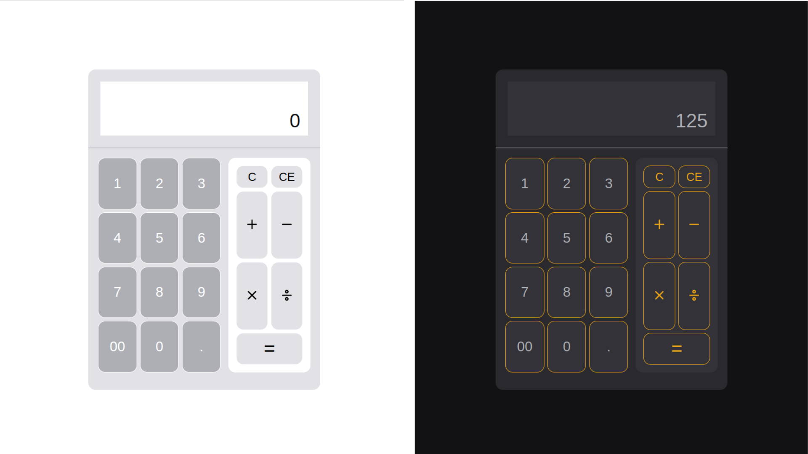

# Calculadora

## 💪 Motivação

Esse projeto consiste em uma calculadora com operações básicas de soma, subtração, multiplicação e divisão. Um projeto bem simples, mas que permite exercitar algumas práticas relacionadas ao ReactJS, tais como a componentização e o uso de hooks. Também tive a oportunidade de aplicar a troca de temas (claro e escuro)

## 💻 Tecnologias

- ReactJs
- Sass

## 🏆 Resultado

A imagem abaixo mostra o design final da parte principal da aplicação. Observa-se, da esquerda para a direita, as cores escolhidas para o modo claro e escuro da aplicação

